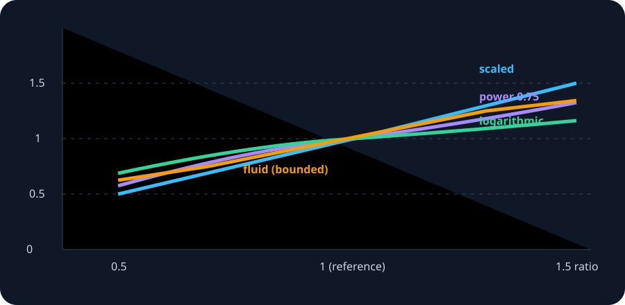

# Mathematics and calculus

[Documentation hub](README.md) · [Strategy catalog](STRATEGIES.md) · [API](API.md)

This is the formal reference for the equations implemented by AppDimens. All screen dimensions are **logical Apple points**, not physical pixels.



## 1. Notation and axioms

| Symbol | Meaning |
|---|---|
| `v` | Design token supplied by the application |
| `w`, `h` | Current window width and height in points |
| `s = min(w,h)` | Smallest window dimension |
| `d` | Dimension selected by `DpQualifier` and `Inverter` |
| `Bw = 300`, `Bh = 533` | Reference width and height |
| `r = d/Bw` | Linear scale ratio |
| `σ` | `displayScale`, in pixels per point |
| `φ` | `fontScale`, representing the user's text-size preference |

The reference canvas is `300 × 533`. Consequently its diagonal is
`sqrt(300² + 533²) ≈ 611.628` and its half-perimeter measure is `300 + 533 = 833`.
Every geometric input is clamped to a positive value by `DimensConfiguration`, so division and logarithms have a valid domain.

## 2. Selecting the effective dimension

`DpQualifier` chooses `.smallWidth`, `.width`, or `.height`. The inverter can swap the axis in portrait or landscape before the equation runs. This distinction matters in split view: the **window**, rather than the device's full display, is the correct responsive boundary.

```swift
let c = DimensConfiguration(screenWidth: 390, screenHeight: 844)
c.dimension(.smallWidth) // 390
c.dimension(.width)      // 390
c.dimension(.height)     // 844
```

## 3. Complete equation table

| Strategy | Result | Mathematical character |
|---|---|---|
| scaled | `v × d/300` | linear |
| density | `v × d/300 × σ` | linear, expressed in pixels |
| diagonal | `v × hypot(w,h)/hypot(300,533)` | Euclidean geometry |
| perimeter | `v × (w+h)/833` | arithmetic combination of axes |
| fit | `v × min(w/300,h/533)` | contain; limiting axis wins |
| fill | `v × max(w/300,h/533)` | cover; expanding axis wins |
| interpolated | `v × [1+(r−1)t]`, `t∈[0,1]` | affine blend |
| power | `v × rᵖ` | sublinear for `0<p<1`, linear at `p=1` |
| percent | `d × percent × v / 10,000` | literal axis percentage |
| fluid | `v × lerp(a,b,clamp((d−L)/(U−L),0,1))` | bounded linear ramp |
| logarithmic | `v × [1+0.4 ln(r)]` if `r≥1`; `v × [1−0.4 ln(1/r)]` otherwise | strongly damped |
| plain / physical | `v` | identity; conversion is handled by `DimensUnits` |

### Worked example: a 16-point token

For a `390 × 844` window and the default smallest-width qualifier, `r = 390/300 = 1.3`:

* scaled: `16 × 1.3 = 20.8 pt`;
* power with `p=0.75`: `16 × 1.3⁰·⁷⁵ ≈ 19.48 pt`;
* interpolated with `t=0.5`: `16 × (1 + 0.3×0.5) = 18.4 pt`;
* logarithmic: `16 × (1 + 0.4 ln(1.3)) ≈ 17.68 pt`;
* 10 literal percent: set `v=10`, `percent=100`; `390×100×10/10,000 = 39 pt`.

## 4. Aspect-ratio correction

The optional scaled branch computes `aspect = max(w,h)/min(w,h)`, normalizes it against `1.78`, and adjusts the slope using sensitivity `k`. It is deliberately opt-in: changing aspect ratio must not silently change established design tokens. Use it only after testing tall phones, iPad split view, landscape, and resizable macOS windows.

## 5. Continuity, monotonicity, and derivatives

For positive dimensions, scaled, diagonal, perimeter, fit, and fill are continuous. Fit/fill are not differentiable exactly where `w/300 = h/533`, because the controlling axis changes, but their values do not jump.

For power, `f(r)=v rᵖ` and `f′(r)=vp rᵖ⁻¹`. A `p` below one progressively reduces the slope; a negative power reverses monotonicity and is rarely appropriate for UI sizing. For the large-screen logarithmic branch, `f′(r)=0.4v/r`, so growth continually slows. Interpolated has constant derivative `vt`; `t=0` is fixed and `t=1` is scaled.

Fluid is continuous at both clamps. Inside the interval its derivative is `v(b−a)/(U−L)`; outside it is zero. If the viewport span is zero, the implementation selects the lower scale below the threshold and the upper scale at or above it, avoiding division by zero.

## 6. Text, pixels, and physical units

Apple layout uses points. A pixel result is `points × displayScale`; it should normally be used only for raster buffers or pixel-aligned drawing. Text with Dynamic Type uses `geometry × fontScale`. Do not use density scaling for ordinary spacing, because SwiftUI and UIKit already rasterize points correctly.

Physical conversion uses `72 pt = 1 in`, `2.54 cm = 1 in`, and `25.4 mm = 1 in`. Device `displayScale` is not physical PPI. Supply calibrated `pixelsPerInch` when a physical measurement must become pixels.

## 7. Precision and rounding

The engine returns IEEE-754 `Double`. Preserve it through calculations, convert to `CGFloat` only at the UI boundary, and let the renderer place the result on the device pixel grid. Repeated integer rounding creates accumulated drift in stacks and grids. For explicit pixel alignment, round in pixel space: `round(points × σ) / σ`.

## 8. Complexity and caching

All strategies are `O(1)`. `DimensFactors` precomputes immutable ratios for repeated hot-loop use. Resize is different: candidate construction is `O(n)` and `largestFitting` is `O(log n)`, provided the `fits` predicate is monotonic.

## 9. Verification checklist

Test the `300 × 533` identity canvas, a phone portrait and landscape, iPad full screen, narrow split view, large Dynamic Type, and a non-integer display scale if your platform supports it. Also check values immediately below, at, and above every fluid or auto breakpoint.
