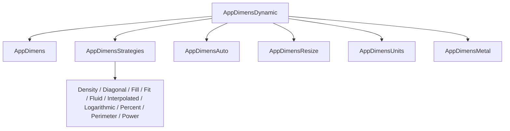

# AppDimens Dynamic for Apple — documentation hub

[← Project README](../README.md) · [API](API.md) · [Apple integration](APPLE-INTEGRATION.md) · [Strategy catalog](STRATEGIES.md) · [Mathematics](MATHEMATICS-AND-CALCULUS.md)

This is the complete documentation set for the direct Swift port. The public baseline is **300 points** and measurements describe the active window/scene—not an arbitrary child view.

## Choose a path

| I want to… | Start here |
|---|---|
| Install with Xcode | [Installation and first screen](../GUIDE-FOR-BEGINNERS.md) |
| Use SwiftUI without passing sizes | [Apple integration](APPLE-INTEGRATION.md#swiftui) |
| Use UIKit with automatic scene discovery | [Apple integration](APPLE-INTEGRATION.md#uikit) |
| Select a scaling curve | [Strategy catalog](STRATEGIES.md) |
| Understand every formula | [Mathematics and calculus](MATHEMATICS-AND-CALCULUS.md) |
| Optimize a hot loop or Metal renderer | [Performance](PERFORMANCE.md) |
| Migrate Android names | [Migration](MIGRATION.md) |
| Diagnose incorrect output | [Troubleshooting](TROUBLESHOOTING.md) |

## Complete library map

## Strategy pages

[Scaled](strategies/scaled.md) · [Density](strategies/density.md) · [Diagonal](strategies/diagonal.md) · [Fill](strategies/fill.md) · [Fit](strategies/fit.md) · [Fluid](strategies/fluid.md) · [Interpolated](strategies/interpolated.md) · [Logarithmic](strategies/logarithmic.md) · [Percent](strategies/percent.md) · [Perimeter](strategies/perimeter.md) · [Power](strategies/power.md) · [Auto](strategies/auto.md) · [Resize](strategies/resize.md) · [Physical units](strategies/physical-units.md)

## Platform support

| Platform | Minimum | Automatic UI integration | Core and strategies | Metal bridge |
|---|---:|---|---|---|
| iOS / iPadOS | 13 | SwiftUI + UIKit | Yes | Yes |
| tvOS | 13 | SwiftUI + UIKit | Yes | Yes |
| macOS | 10.15 | SwiftUI | Yes | Yes |
| visionOS | 1 | SwiftUI + UIKit | Yes | Yes |

watchOS is intentionally not advertised: the current public package depends on window and Metal APIs that do not form a complete watchOS contract.
