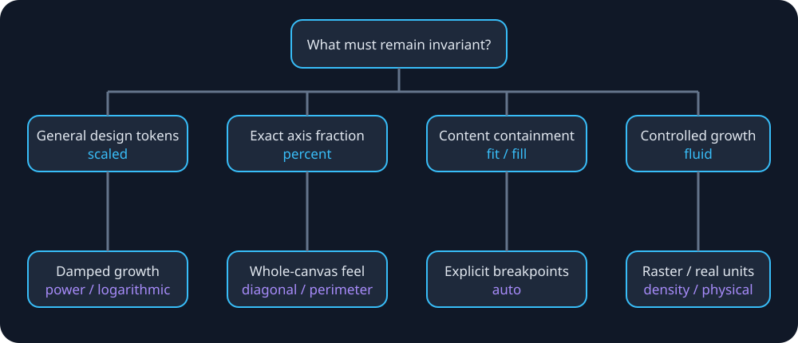

# Scaling strategy catalog

[Documentation hub](README.md) · [Mathematics](MATHEMATICS-AND-CALCULUS.md) · [API](API.md)

Every strategy answers a different design question; they are not quality levels. Begin with **scaled**, measure the mismatch, and adopt another curve only when its invariant matches the requirement.



## Selection matrix

| Requirement | Recommended | Avoid / warning |
|---|---|---|
| General spacing, radii, controls | [scaled](strategies/scaled.md) | Linear growth may be strong on desktop |
| Explicit conditional tokens | [auto](strategies/auto.md) | Do not recreate device-model tables |
| Raster buffer or pixel API | [density](strategies/density.md) | Never use as SwiftUI/UIKit points |
| Two-axis canvas perception | [diagonal](strategies/diagonal.md), [perimeter](strategies/perimeter.md) | Tall windows affect size |
| Entire reference canvas visible | [fit](strategies/fit.md) | Empty margins are expected |
| Reference canvas covers boundary | [fill](strategies/fill.md) | Cropping is expected |
| Hard minimum/maximum growth | [fluid](strategies/fluid.md) | Bounds require product decisions |
| Partial responsiveness | [interpolated](strategies/interpolated.md) | Still unbounded |
| Strong large-screen damping | [logarithmic](strategies/logarithmic.md) | Validate very small synthetic windows |
| Literal percentage of an axis | [percent](strategies/percent.md) | Protect accessibility minima |
| Tunable smooth curve | [power](strategies/power.md) | Exponent changes behavior substantially |
| Largest size that fits measured content | [resize](strategies/resize.md) | Predicate must be monotonic |
| Print/calibrated measurement | [physical units](strategies/physical-units.md) | Display scale is not PPI |

## Runtime selection example

```swift
import AppDimensDynamic

let c = DimensConfiguration(screenWidth: 1024, screenHeight: 768)
let strategy: DimensStrategy = prefersBoundedGrowth ? .fluid : .scaled
let options = StrategyOptions(
    qualifier: .width,
    fluidViewport: 320...1024,
    fluidScale: 0.85...1.30
)
let gutter = DynamicDimens.resolve(16, strategy: strategy, configuration: c, options: options)
```

## Common options

`qualifier` selects smallest width, width, or height. `inverter` changes axis selection under an orientation rule. `ignoreMultiWindows` returns the raw design value for constrained windows. Curve-specific fields (`power`, `interpolation`, `percent`, and fluid ranges) are read only by their strategies. Aspect correction belongs to the principal scaled/auto path; fit, fill, diagonal, and perimeter already use both axes explicitly.

## A repeatable selection process

1. State the invariant in plain language: “10% of width,” “never crop,” or “stop growing after 768 points.”
2. Choose the row that encodes that invariant mathematically.
3. Calculate expected values at the reference, smallest supported window, and largest supported window.
4. Validate rotation, split view, Dynamic Type, and live resize.
5. Store strategy options beside design tokens so tuning remains consistent.

See each linked page for equations, worked arithmetic, Swift examples, recommendations, and failure modes.
